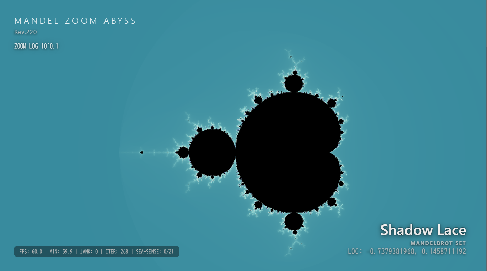

# Mandel Zoom Abyss

WebGPU + WebAssembly GMP + 摂動法による、リアルタイム・マンデルブロ深度ズーム作品です。  
10^15(1000兆倍)クラスの世界を、ブラウザ上でリアルタイムに探索することを目指しています。

A real-time Mandelbrot deep zoom artwork powered by WebGPU, WebAssembly GMP and perturbation rendering.  
This project explores the world of 10^15 magnification directly in the browser.

---

# 🌐 Demo / 公開ページ

この作品は WebGPU を利用しており、描画にはGPUをかなり使います。

そのため、まずは小さめに表示する「ミニマル展示版」を用意しています。  
ノートPCなどでも眺めやすいサイズにしていますので、まずはこちらからどうぞ。(*´ω｀*)

- [Minimal Demo / ミニマル展示版](./src/demo.html)

より大きく見たい場合は、環境に合わせて本体ページもお試しください。

- [Main Viewer / 本体ページ](./src/mandelzoomabyss.html)

The iframe viewer is intentionally kept smaller for lighter viewing.  
This artwork uses WebGPU heavily, so GPU load can become fairly high depending on the environment.

---

# 🌀 About / 概要

CPU側では WebAssembly版 GMP による512bit精度の基準軌道を計算し、  
GPU側では WebGPU の f32 shader で摂動法による差分描画を行っています。

The CPU calculates a 512-bit precision reference orbit using WebAssembly GMP,  
while the GPU renders nearby pixels using f32 perturbation rendering shaders.

すべてのピクセルを多倍長で直接計算するのではなく、  
高精度な基準軌道とGPU並列描画を組み合わせることで、  
ブラウザ上でリアルタイムな深度ズームを目指しています。

Instead of calculating every pixel with arbitrary precision,  
the renderer combines a high-precision reference orbit with GPU parallel rendering  
to achieve real-time deep zoom rendering in the browser.

---

# 🚀 Beyond WebGL2 limits / 従来限界の突破

従来のWebGL2までの環境ですと、f32だけでは精度が足りず、  
せいぜい10^6(100万倍)程度のズームが限界でした。

しかし、WebGPU と GMP + 摂動法 の組み合わせにより、  
従来の限界を突破することができました。

長年の理想が現実のものになり、私はとても興奮しています！

With conventional environments up through WebGL2,  
f32 precision alone was generally limited to around 10^6 magnification.

By combining WebGPU with GMP-based arbitrary precision arithmetic and perturbation rendering,  
this project breaks beyond those traditional limits.

A long-time dream has finally become reality, and I am genuinely excited about it!

---

# ⚙ Technical Notes / 技術メモ

- WebGPU によるリアルタイム描画
- WebAssembly版 GMP による512bit多倍長基準軌道計算
- GPU f32 摂動法による並列描画
- storage buffer による基準軌道転送
- palette LUT による色制御
- SEA-SENSE による海領域検出
- 聖地ローテーションによる自動巡礼演出(100箇所)

- Real-time rendering with WebGPU
- 512-bit arbitrary precision reference orbit calculation using GMP
- GPU f32 perturbation rendering
- storage buffer based orbit transfer
- palette LUT based color control
- SEA-SENSE ocean detection
- Automatic pilgrimage-style scene rotation across 100 sacred spots

---

# 📖 Source / ソースについて

また、ソースはなるべく読みやすいよう、  
1ファイル内へ整理してコメントを多めに入れています。

WebGPU / WebAssembly GMP / 摂動法による深度ズーム実装を、  
creative coding 的な形で読めるサンプルとして残すことも目的にしています。

The source is intentionally kept in a mostly single-file style with many comments,  
so the implementation can also be read as a creative coding style technical sample.

---

# 🎨 Credits / 謝辞

配色設計については、  
TOMOQ1024氏の Mandelbrot-Set-Viewer の設計を参考にさせて頂きました。

https://github.com/TOMOQ1024/Mandelbrot-Set-Viewer

氏の配色がとても好きなんです。素敵な作品をありがとうございます！

The color design of this project was inspired by TOMOQ1024's Mandelbrot-Set-Viewer.

また、マンデルブロ深度ズーム文化、  
perturbation rendering 系研究、  
creative coding community に感謝します。

Special thanks to the Mandelbrot deep zoom community,  
perturbation rendering researchers,  
and the creative coding community.

---

# 🤖 AI-assisted implementation

技術実装にはAI支援も利用しています。

ただし、システム設計、描画思想、最適化方針、  
WebGPU + WebAssembly GMP + 摂動法 の組み合わせ、  
演出設計は作者によるものです。

Some implementation work was assisted by AI tools.  
However, the system design, rendering direction, optimization ideas,  
and the combination of WebGPU + GMP + perturbation rendering were directed by the author.

---

# 📫 作者

- X（旧Twitter）：[@voich2014](https://twitter.com/voich2014)  
- Bluesky：[@voich2014.bsky.social](https://bsky.app/profile/voich2014.bsky.social)  
- YouTube：[voichannel](https://www.youtube.com/@voichannel)
- BOOTH：[ぼいちWORKS](https://voichworks.booth.pm/)

---

# 📄 License / ライセンス

Copyright (c) 2026 ぼいち

Released under the MIT license.  
see https://opensource.org/licenses/MIT

Where a citation is listed, please also check the license of the citing source.

The source code is licensed MIT.

However, rendered images and videos created using this source code are licensed under CC BY-NC-SA 4.0.

https://creativecommons.org/licenses/by-nc-sa/4.0/

